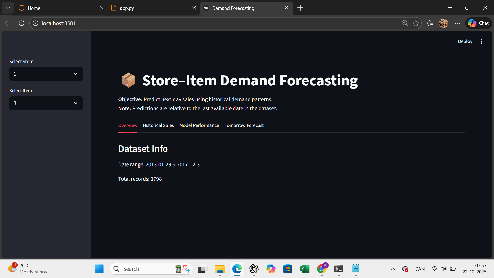
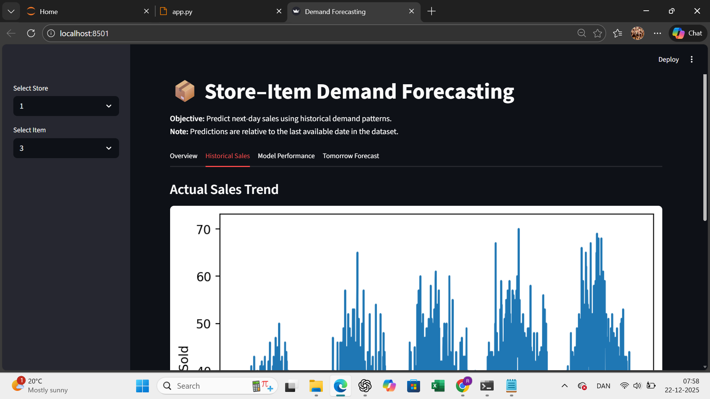
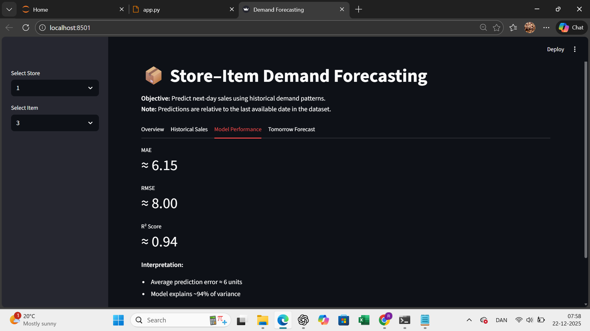
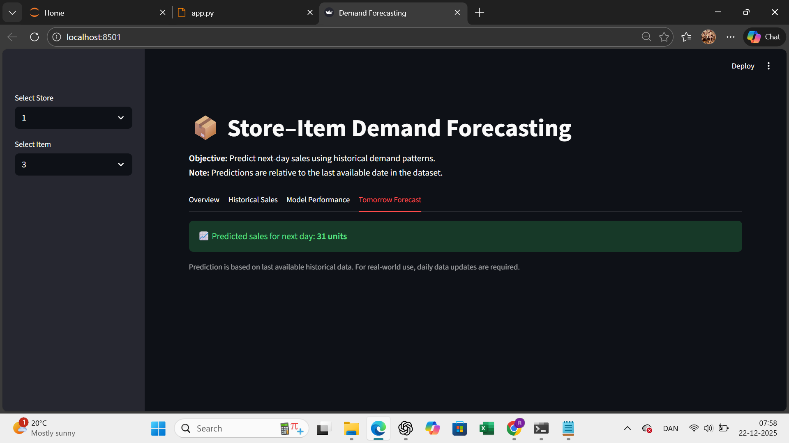

# Store-Item Demand Forecasting 📦📊

## Project Overview

This project focuses on **store–item demand forecasting** using historical sales data and machine learning.

⚠️ Note: This repository does not host a live web application.  
The Streamlit interface was used locally for experimentation.  
For portfolio purposes, results and UI are demonstrated via screenshots.


## Problem Statement
Retail businesses need accurate demand forecasts to:
- Avoid stockouts
- Reduce overstock
- Improve inventory planning

This project forecasts **tomorrow’s sales quantity** based on past sales patterns.

## Dataset
- Historical daily sales data
- Columns include:
  - date
  - store_id
  - item_id
  - sales

> Note: Predictions are relative to the **last available date** in the dataset.

## Feature Engineering
Additional features were created, including:
- Lag features (previous day sales)
- Rolling means
- Growth rates
- Calendar features (day, week, month, weekend)

These help the model learn **seasonality, trends, and momentum**.

## Model
- Algorithm: **XGBoost Regressor**
- Train-test split based on time (no data leakage)
- Evaluation metrics:
  - MAE
  - RMSE
  - R² Score

## Results
- Test MAE: ~6 units  
- R² Score: ~0.93  
This shows strong predictive performance compared to a naïve baseline.

## Streamlit App
An interactive Streamlit app allows users to:
- Select Store ID
- Select Item ID
- View predicted next-day sales

## How to Run
```bash
pip install -r requirements.txt
streamlit run app.py
## Demo Screenshots

### Overview


### Historical Sales


### Model Performance


### Next-Day Prediction


